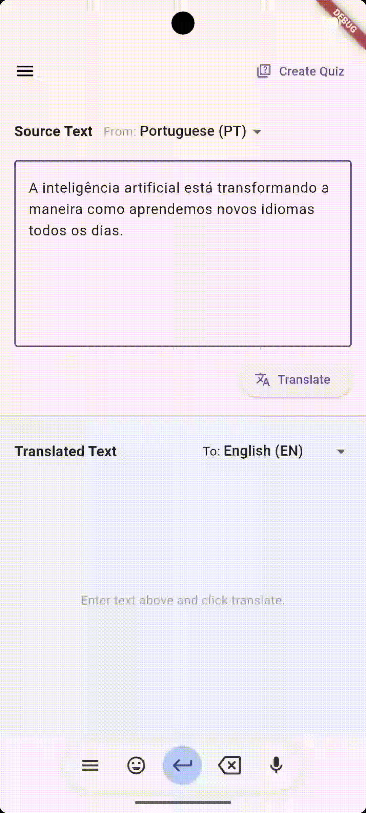

# AI Translation and Quiz App 🌍📱

[English](./README.md) | [Português](./README.pt.md)

A full-stack language-learning and translation application that provides real-time translations, granular word alignments, natural text-to-speech audio, and AI-generated comprehension quizzes.

  

## 👨‍💻 Development Stack

### 📱 Frontend
* **Framework:** Flutter (Cross-platform mobile app)
* **State Management:** Flutter Riverpod (Notifiers)
* **Networking:** Dio (HTTP client)
* **Storage:** Flutter Secure Storage (Encrypted local persistence)

### ☁️ Backend & AI
* **Server:** Node.js, Express.js (TypeScript)
* **Database:** MongoDB (Mongoose ORM)
* **Authentication:** JWT-based authentication tokens
* **Cloud Services:** Microsoft Azure AI Speech (TTS) & Translation Services; Google AI APIs

## 💬 Features
* **Neural Translation:** Translates text across multiple languages with word-alignment mapping.
* **Interactive Word Lookup:** Tap any word in the translated text to view its dictionary definition, part of speech, and contextual examples.
* **Text-to-Speech Pronunciation:** Native-sounding audio playback powered by Azure neural voices.
* **AI Comprehension Quizzes:** Automatically generates interactive multiple-choice quizzes based on the translated session to test retention.
* **Translation History:** Save, manage, and seamlessly navigate through past translation sessions via a slide-out drawer.

---

## 🛠️ Installation & Getting Started

To run this project locally, refer to the specific configuration guides in each directory:
* 🖥️ **Backend Setup:** Check [`server/README.md`](./backend/README.md)
* 📱 **Frontend Setup:** Check [`client/README.md`](./frontend/README.md)